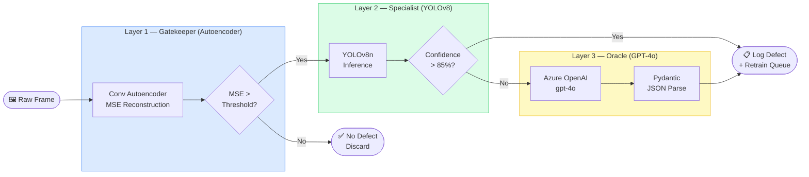
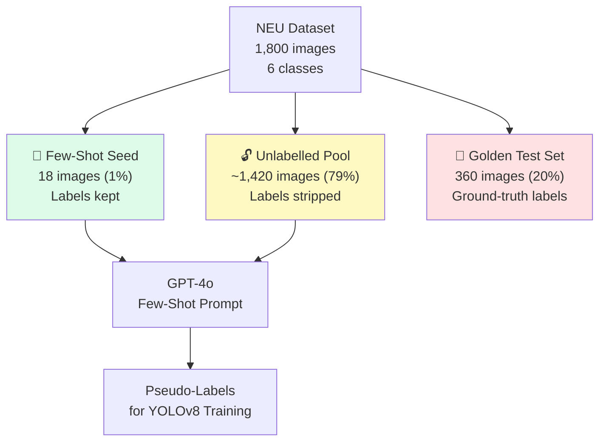
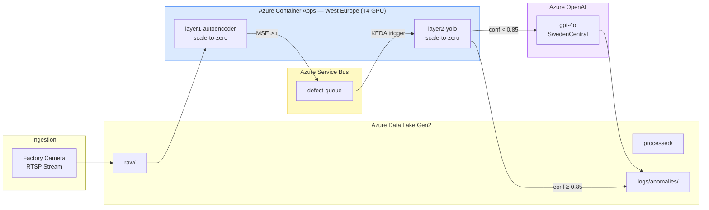
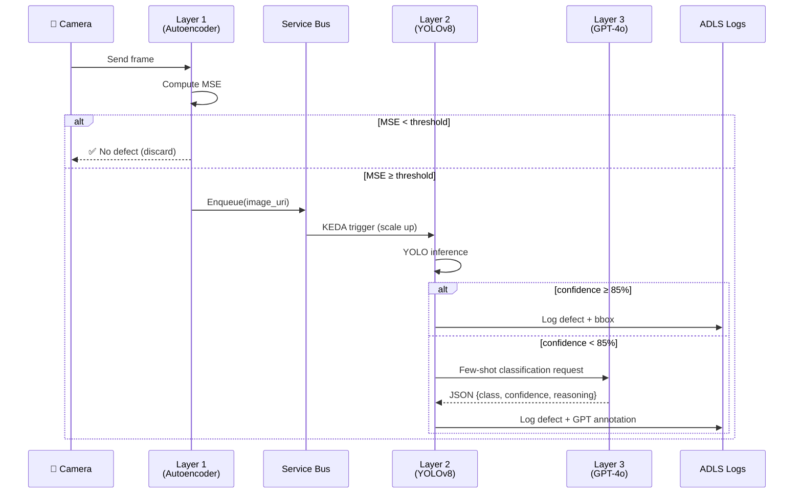

# Skill: Mermaid.js Diagrams in Quarto

## Core Rule
When generating architecture or flow diagrams for this project, always use **Mermaid.js** syntax
inside Quarto `.qmd` files. Never use static images for diagrams that can be expressed in Mermaid.

---

## Quarto Mermaid Block Syntax

````markdown
```{mermaid}
%%| label: fig-cascade-architecture
%%| fig-cap: "Cascade Defect Detection Pipeline"
flowchart LR
    ...
```
````

---

## Preferred Diagram Styles

### 1. System Architecture — Left-to-Right Flowchart



### 2. Data Split Strategy — Pie or Flowchart



### 3. Azure Infrastructure — Left-to-Right



### 4. Sequence Diagram — Request Lifecycle



---

## Styling Guidelines

- Use `fill` and `stroke` to colour subgraph backgrounds consistently:
  - Layer 1 (Autoencoder): `fill:#dbeafe,stroke:#3b82f6` (blue)
  - Layer 2 (YOLOv8):      `fill:#dcfce7,stroke:#22c55e` (green)
  - Layer 3 (GPT-4o):      `fill:#fef9c3,stroke:#eab308` (yellow)
  - Azure infra:            `fill:#f1f5f9,stroke:#64748b` (slate)
- Always add `%%| fig-cap:` labels for Quarto cross-referencing
- Keep node labels short; use `\n` for line breaks inside nodes
- Prefer `flowchart LR` for pipeline diagrams, `flowchart TD` for hierarchical data splits
