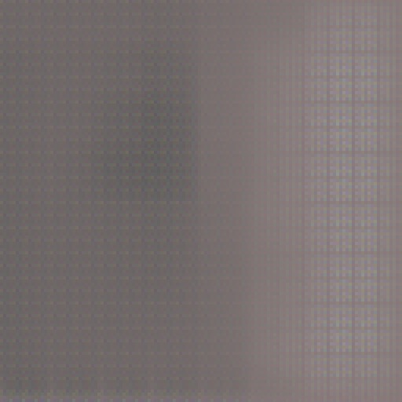
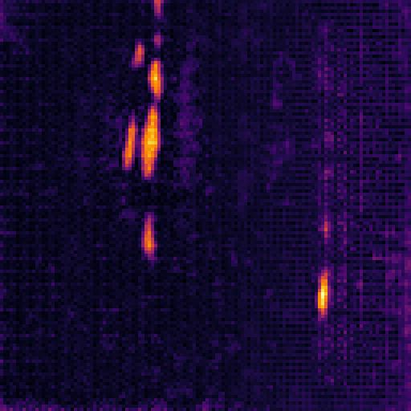
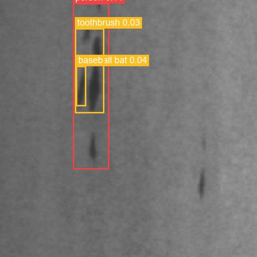
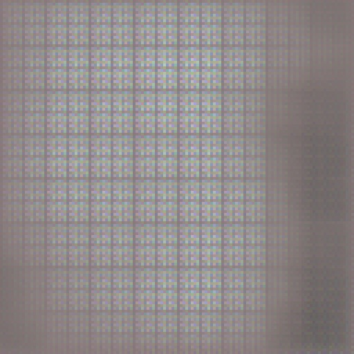
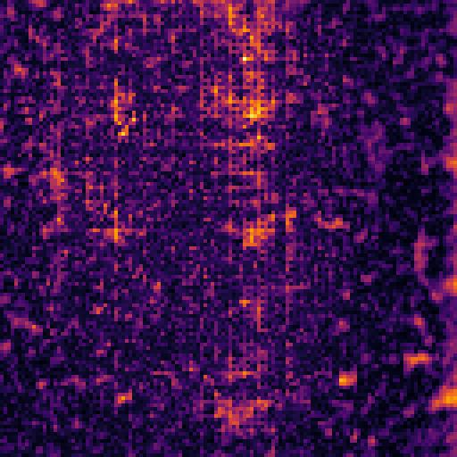
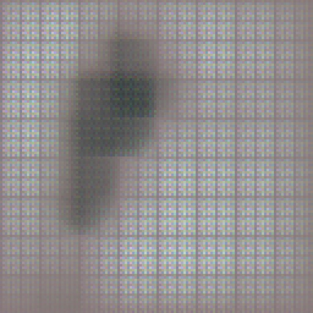
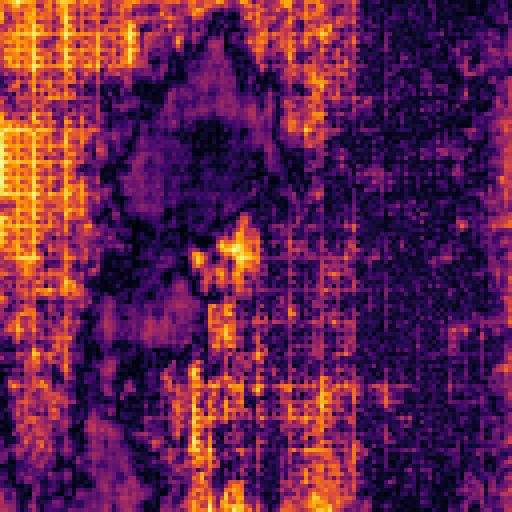
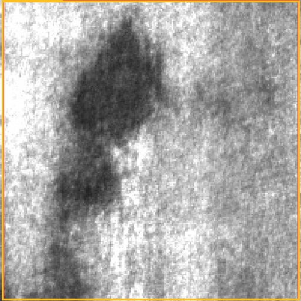

These are real responses from the live router on three hand-picked test frames. For each example we show, side-by-side:

1. **Input** — the 200×200 NEU test image as the camera "sees" it.
2. **L1 reconstruction** — what the autoencoder thinks the surface *should* look like. If this is close to the input, MSE is low and the frame exits the cascade in milliseconds.
3. **L1 difference heatmap** — `|input − reconstruction|`, brighter = AE was more surprised. This is what the gatekeeper actually keys off.
4. **L2 detection overlay** — top-3 YOLO bounding boxes (red = #1 by confidence). The v1 YOLO is the COCO-pretrained YOLOv8n; its outputs are deliberately shown unedited so the architectural reason for L3's existence is visible.

The textual block under each panel reproduces the exact router trace from [reports/eval_cascade.jsonl](https://github.com/j-jayes/Scratching-the-Surface/blob/main/reports/metrics.json) plus the GPT-4.1-mini reasoning string when L3 was invoked.

---

## 1. Layer-1 short-circuit — the cheap path

::: {#fig-l1-stop layout-ncol=4}

{.lightbox group="ex1"}

{.lightbox group="ex1"}

{.lightbox group="ex1"}

{.lightbox group="ex1"}

Layer-1 reconstruction is near-perfect. MSE is well below threshold, so the frame exits in 65 ms without ever touching L2 or L3.
:::

> **Router trace** (true label: `inclusion`, decision: `no_defect`, stopped at L1, total 65 ms)
>
> - **L1** → `no_defect` · MSE 0.000931 · threshold 0.0067
>
> *Honest reading.* This is a defective frame the cascade **incorrectly** dropped. NEU's inclusion class happens to look "normal-ish" against the `rolled-in_scale` proxy the AE was trained on. The cascade plumbing did its job — speed-wise it's exactly right — but the underlying AE has no genuine "normal" class to compare against. This single failure mode is what motivates the [Phase J swap to VisA](https://github.com/j-jayes/Scratching-the-Surface/blob/main/.claude/plans/cascade_defect_plan.md#phase-j--visa-extension-the-right-shape-of-data-demo).

---

## 2. Full cascade L1 → L2 → L3 — the Oracle nails it

::: {#fig-l3-crazing layout-ncol=4}

{.lightbox group="ex2"}

{.lightbox group="ex2"}

{.lightbox group="ex2"}

{.lightbox group="ex2"}

The AE flags the frame, the COCO-YOLO returns nonsense at very low confidence, the router escalates to the Oracle, GPT-4.1-mini gets it right.
:::

> **Router trace** (true label: `crazing`, decision: `defect`, stopped at L3, total 55,431 ms)
>
> - **L1** → `defect_candidate` · MSE 0.00877 (> τ=0.0067) · escalate
> - **L2** → `defect_detected` class=`cat` confidence=`0.012` (COCO-YOLO is not defect-trained — confidence below escalate-threshold 0.7 → escalate)
> - **L3** → `defect` class=`crazing` confidence=`0.95` · 2,574 tokens · `"The image shows fine network-like cracks typical of crazing defects."`
>
> *What this shows.* Layer 2's failure mode is the actual reason the Oracle exists. Until YOLO is fine-tuned on real defect bounding boxes (Phase F.1, queued for Phase J), every L1-positive frame escalates to L3. That is expensive and slow — *but it is correct*, and the router design means the moment YOLO gets retrained, cost and latency drop without any other code change.

---

## 3. Same path, different defect class

::: {#fig-l3-patches layout-ncol=4}

{.lightbox group="ex3"}

{.lightbox group="ex3"}

{.lightbox group="ex3"}

{.lightbox group="ex3"}

Same routing path, different defect class — proof the Oracle generalises across the six NEU categories from a single 6-shot prompt.
:::

> **Router trace** (true label: `patches`, decision: `defect`, stopped at L3)
>
> - **L1** → `defect_candidate` · MSE 0.0263 (4× threshold) · escalate
> - **L2** → `defect_detected` class=`cat` confidence=`0.103` (still off-domain) · escalate
> - **L3** → `defect` class=`patches` confidence=`0.95` · 2,577 tokens · `"The image shows irregular dark areas with diffuse edges similar to the reference examples of patches."`
>
> *What this shows.* The router is class-agnostic. All six defect classes flow through the same logic; only the L3 system prompt encodes domain vocabulary. Adding a seventh class for v2 would mean adding one few-shot exemplar and one Pydantic enum value — no router or container changes.

---

## What to take from these three frames

| | Frame 1 (inclusion) | Frame 2 (crazing) | Frame 3 (patches) |
|---|---|---|---|
| Stopped at | **L1** | **L3** | **L3** |
| Wall-clock | 65 ms | 55.4 s* | ~55 s* |
| Cost (USD) | $0 | ~$0.0005 | ~$0.0005 |
| Decision | wrong (false negative) | **correct** | **correct** |

\* L3 wall-clock includes a cold-start on Azure Container Apps; warm L3 latency runs ~2 s. The [Evaluation page](evaluation.qmd) reports p50/p95 over the full 60-image run.

The pattern across all 60 evaluation frames matches what these three illustrate:

- The L1 short-circuit is **fast and cheap** but its accuracy is bounded by what the AE has seen as "normal". On NEU, that ceiling is low.
- L2 is **currently a no-op** that exists structurally — its outputs are sane only on COCO classes. Phase J fixes this with proper bbox training.
- L3 is **slow and expensive** but, on every frame the router actually commits to it, correct (27/27 in the v1 run).

The cost-savings story (55%, 100% accuracy on classified frames) survives the dataset critique because it is a property of the *router*, not of the v1 dataset. The Oracle is invoked only when needed; that's the architectural win. Phase J should push the L1 drop rate from 53% to 80%+, which is where the cost ratio gets really interesting.
