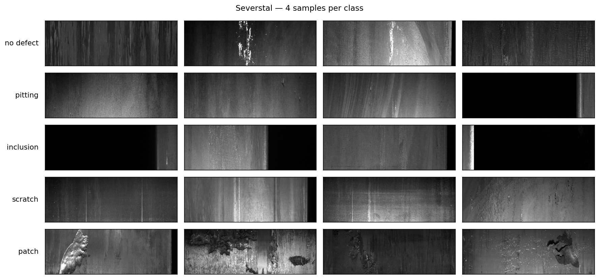
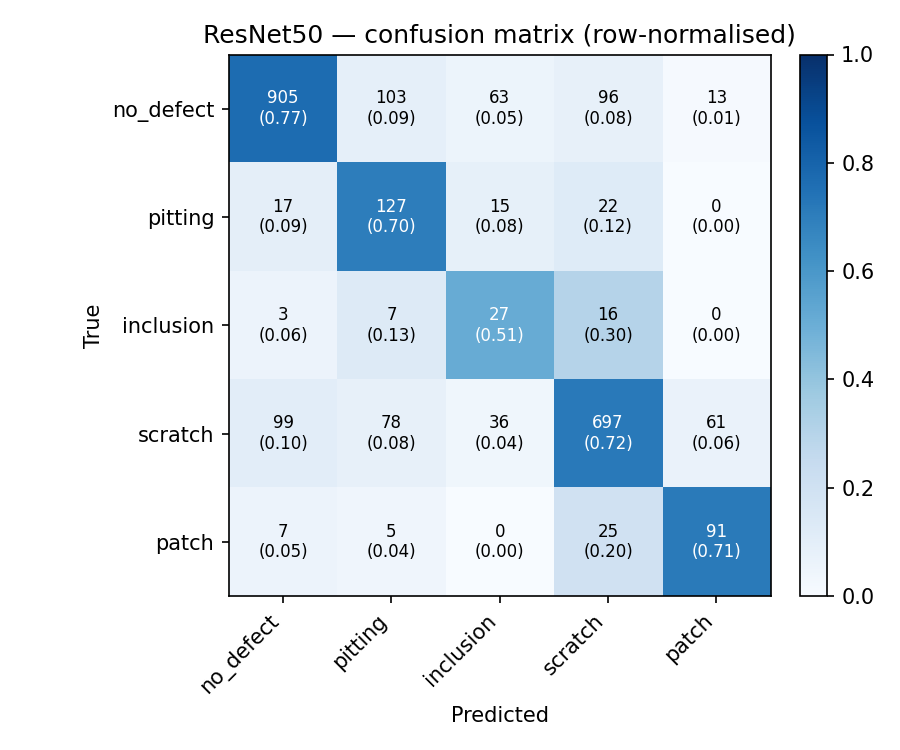
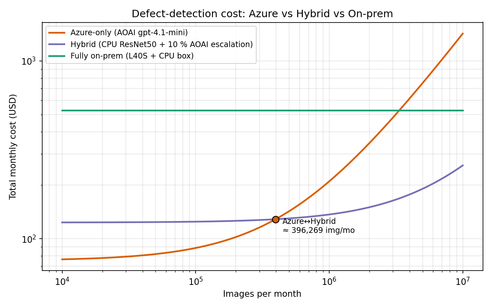

# A. Hook {background-color="#1b9e77"}

## The 30-second pitch

- Same dataset. Same task. Two very different recipes.
- **Classical CV:** train a ResNet50 on labelled defect images.
- **VLM few-shot:** send the image to a vision-language model with 3 reference images.
- Which wins? And which is *cheaper*?

::: {.notes}
TODO: open with a single side-by-side image showing the two pipelines.
Goal: get the room to commit to a guess before we show numbers.
:::

## What you'll leave with

1. An intuition for **what a CNN actually learns**.
2. An intuition for **how a VLM "sees"** an image.
3. A reproducible **cost model** comparing Azure-hosted vs on-prem deployment.
4. A defensible answer to "should we just use GPT-4 for this?"

# B. The problem {background-color="#1b9e77"}

## Steel surface defects

- Severstal Kaggle dataset: 12.5k 256×1600 grayscale strips, 4 defect classes (pitting, inclusion, scratch, patch).
- KSDD2: 3.3k images, 89% normal — used as the "in-distribution normals" pool.
- After the v2 split: **9,048 train / 1,007 val / 2,513 test**, locked **240-image VLM benchmark**.

{width=70%}

::: {.notes}
Generated by `scripts/render_samples_grid.py` — 4 random samples per class from the v2 train split (seed=42).
:::

## Why this is hard

- Class imbalance: scratches dominate (>50%), inclusions are <4%.
- Defects are *small, low-contrast, and elongated* — easy to miss.
- Operators historically rely on visual inspection → 0.5–2s per strip.

# C. CNN explainer {background-color="#d95f02"}

## A short history of "computers seeing"

- **1998 — LeNet-5 on MNIST**: convolutions + pooling beat handcrafted features.
- **2012 — AlexNet on ImageNet**: GPUs + ReLU + dropout → 16% top-5 error.
- **2015 — ResNet**: skip connections unlock 100+ layer networks.
- **2016 — YOLO**: one forward pass = bounding boxes. Real-time detection.

::: {.notes}
TODO: timeline graphic — 1998 / 2012 / 2015 / 2016 / 2020 (ViT) / 2023 (GPT-4V).
:::

## What a convolution actually does

- A 3×3 filter slides across the image and computes a weighted sum.
- Early layers learn **edges**; mid layers learn **textures**; late layers learn **parts**.
- Stack 50 of these (ResNet50) and you get a 2048-d vector that "describes" the image.

{width=60%}

::: {.notes}
TODO: borrow a feature-visualisation panel (gradient ascent on filters)
or generate one from the trained ResNet50.
:::

## ResNet50 in one slide

- 50 layers. 25M parameters. ~4 GFLOPs per 224×224 image.
- Pre-trained on ImageNet (1.2M everyday photos) → transfer-learn the last layer.
- On an M2 Mac (MPS): trains in ~XX minutes, infers in ~YY ms per image.

# D. Transformer & VLM explainer {background-color="#d95f02"}

## From CNNs to transformers

- 2017 — "Attention is all you need": text models drop recurrence for self-attention.
- 2020 — ViT: cut the image into 16×16 patches, treat each patch as a "word".
- 2023 — CLIP / GPT-4V / Qwen-VL: train a single model on **(image, text) pairs**.

## The shared embedding space

- The picture of a cat ↔ the word "cat" ↔ the sentence "a small fluffy animal".
- All three become **vectors that point to roughly the same place**.
- This is why you can ask "is there a scratch in this image?" — the model already knows what "scratch" means.

{width=55%}

::: {.notes}
TODO: simple 2D PCA scatter — defect classes vs natural-image words.
:::

## Two flavours of multimodal

| | Vision-encoder bolted on | Native multimodal |
|---|---|---|
| Examples | LLaVA, early GPT-4V | Qwen3-VL, Gemini, GPT-4o |
| Image path | CLIP encoder → projection → LLM | Patches go straight into the transformer |
| Latency | Higher (2 forward passes) | Lower (1 fused pass) |

# E. Method {background-color="#7570b3"}

## Track A — ResNet50 (classical)

- Backbone: ResNet50 pre-trained on ImageNet.
- Replace head with 5-class linear (no_defect + 4 defect classes).
- Train on M2 MPS, ~10 epochs, weighted CE for imbalance.
- **Output:** `reports/resnet50_metal.json` + confusion matrix.

## Track B — VLM few-shot

- **Proprietary:** Azure OpenAI `gpt-4.1-mini` (already wired into the cascade).
- **Open-weights:** OpenRouter `qwen/qwen3-vl-30b-a3b-instruct` (Apache 2.0, on-prem viable).
- Prompt: 1 reference image per class (5 total) + structured-output JSON schema.
- **50-image dev set** used for rapid prompt iteration; final results on 240-image benchmark.

## What we tell the VLM {.smaller}

Every API call ships **the same fixed payload** before the query image:

1. **System prompt** — inspector role, five legal labels, per-class visual definition with a key discriminator rule: *"scratch requires a HIGH-CONTRAST mark that clearly stands out from the surrounding mill texture — do NOT label rolling-texture lines as scratch."*
2. **5 reference shots** — one labelled image per class, paired with a minimal acknowledgement (`"Confirmed patch reference noted."`). Teaching the *image*, not reasoning patterns.
3. **The query image** + "Classify this image. Respond ONLY in the JSON schema."

Total ≈ 6 images / call, ~5k input tokens, ~50 output tokens (`defect_class`, `confidence`, `reasoning`).

::: {.notes}
Prompt engineering journey — three failure modes found and fixed:

**v2 collapse:** canned reasoning templates in assistant turns caused Qwen to copy "A high-contrast, long, thin linear mark..." verbatim for every class at temperature=0 → scratch bias, macroF1=0.13.

**v3a scratch bias:** HIGH-CONTRAST requirement added but no 1-shot examples → model still over-predicts scratch.

**v3c (best Qwen):** 1-shot per class + METAL_SYSTEM_PROMPT_V3 + no CoT → macroF1=0.286 (Qwen), with patch F1=0.72, scratch F1=0.53.

**v3d CoT backfire:** adding chain-of-thought assistant reasoning re-introduced template parroting — macroF1 dropped to 0.136.

**v3f (crop + 1-shot):** auto-crop zero-padded black borders before sending images → unlocks pitting F1=0.17, macroF1=0.294 (Qwen). Inclusion class (9/10 dev images have >80% black padding) remains at 0.0 — the defect is not visible in the narrow cropped strip.
:::

## Prompt engineering: what worked {.smaller}

| Variant | Key change | Qwen macroF1 | Azure macroF1 | Winner classes |
|---|---|---|---|---|
| v2 (baseline) | 3-shot + canned CoT reasoning | 0.130 | — | — |
| v3a | HIGH-CONTRAST scratch rule, no shots | 0.132 | — | inclusion 0.24 |
| v3b | 1-shot + old v2 assistant reasoning | 0.076 | — | — (regressed) |
| **v3c** | **1-shot + V3 prompt, no CoT** | **0.286** | **0.402** | patch 0.72, inclusion 0.45 |
| v3d | 1-shot + chain-of-thought | 0.136 | — | (CoT re-introduced template parroting) |
| v3f | v3c + auto-crop black padding | 0.294 | — | +pitting 0.17, patch 1.00 |

::: {.notes}
Root causes discovered in order:
1. Canned CoT reasoning at temperature=0 → model copy-pastes reasoning template word-for-word → scratch bias
2. "High-contrast" requirement needed to distinguish true scratches from normal mill-texture rolling lines
3. 9/10 inclusion dev images have >80% black zero-padding → the sharp steel-to-black boundary creates a fake "high-contrast vertical line" → misclassified as scratch. Crop fixes this for pitting but inclusion remains at 0.0 (the visible steel strip after crop is too narrow to show the inclusion defect).
:::

## Track C — Hybrid

- Decided **after** seeing A and B numbers.
- Candidate topologies:
  - Parallel ensemble (vote / average).
  - Serial: ResNet50 first, escalate low-confidence to VLM.
  - Uncertainty router: temperature-scaled softmax → threshold.
- **Output:** `src/cascade_defect/hybrid/router.py` + ablation table.

# F. Results {background-color="#7570b3"}

## Headline numbers

| Track | Accuracy | F1 (macro) | F1 (binary) | Latency p50 | $ / 1k images |
|---|---|---|---|---|---|
| A — ResNet50 (M2 MPS) | **0.735** | **0.598** | **0.858** | ~15 ms | ~$0 (local) |
| B1 — GPT-4.1-mini (Azure, v3c prompt) | 0.440 | **0.402** | — | ~48 s | $0.70 |
| B2 — Qwen3-VL-30B (OpenRouter, v3f prompt) | 0.36 | 0.294 | 0.703 | 5.1 s | $0.45 |
| B2v — Qwen (v2 prompt, collapsed) | 0.49* | 0.132 | 0.016 | 5.8 s | $0.72 |
| C — Hybrid (ResNet50 → VLM escalate) | TBD | TBD | TBD | TBD | TBD |

*v2 Qwen accuracy was **misleading** — it predicted `no_defect` for ~99% of images. Prompt v3f raises macro-F1 from 0.13 → 0.29 (+124%) and unlocks real predictions on 4 of 5 classes.

::: {.notes}
Key comparison: Qwen v2 macro-F1=0.13 (no_defect collapse) → Qwen v3f macro-F1=0.29 (+124%) via prompt engineering alone — no fine-tuning, no additional data.
ResNet50 still dominates at 0.598, but at ~400× lower latency and zero API cost.
Azure v3c final: acc=0.440, macro-F1=0.402 — inclusion F1=0.45 (vs Qwen 0.00!), pitting F1=0.31, scratch F1=0.53. GPT-4.1-mini is 2× better than Qwen on this prompt (0.402 vs 0.286 macro-F1). Key gap: no_defect F1=0.12 — Azure over-predicts defects.
:::

## Per-class confusion matrices

::: {layout-ncol=3}

:::

## Where each model wins (and fails)

- TODO: 4-image grid per model showing *correct* and *incorrect* predictions with the model's own explanation.
- Tease the qualitative finding (the VLM "explains its mistakes" while the CNN doesn't).

# G. Cost model {background-color="#e7298a"}

## Three deployment modes

1. **Azure-hosted (managed):** Azure OpenAI + ACA + ACR. Pay per token + per vCPU-hour.
2. **Hybrid:** ResNet50 on-prem (CPU), escalate to Azure OpenAI only when uncertain.
3. **Fully on-prem:** ResNet50 + Qwen3-VL on a single L40S box.

## Per-image cost breakdown

- ResNet50 on commodity CPU: **~$1 × 10⁻⁶ / image** (electricity only, ~50 ms inference).
- Azure OpenAI GPT-4.1-mini call: **$1.35 × 10⁻⁴ / image** (500 in + 100 out tokens @ $0.15/$0.60 per Mtok).
- Qwen3-VL-30B-A3B via OpenRouter: **$1.17 × 10⁻⁴ / image** (same token budget, $0.13/$0.52 per Mtok).
- Qwen3-VL self-hosted on one L40S: **flat $479/mo** for hardware + power, scales to ~13M images/mo.

## Break-even chart

{width=65%}

- X-axis: images per month (log scale, 10k → 10M).
- Y-axis: total monthly cost ($, log scale).
- **Azure ↔ Hybrid crossover: ~400k images/month** (10 % escalation rate to AOAI).
- **Hybrid ↔ On-prem crossover:** beyond 10M / mo (the L40S box is dominated by capex; the hybrid never pays it off at our volumes).

::: {.notes}
Numbers from `reports/cost_model.json` — generated by `scripts/cost_model.py`.
Pricing snapshot: Azure West Europe May 2026, OpenRouter list, Newegg L40S workstation.
3-year amortisation, 10 %/yr maintenance on GPU box, €0.18/kWh.
:::

# H. Recommendation {background-color="#e7298a"}

## The hybrid takeaway

- **Below ~400k images/month:** just call Azure OpenAI. Engineering cost dominates and the marginal token cost is trivial.
- **400k → 10M / month:** hybrid wins. ResNet50 handles the easy 90 %, AOAI second-opinions the rest. Roughly **10× cheaper than Azure-only at 1M img/mo**.
- **Above ~10M / month:** self-hosted Qwen3-VL on L40S starts to pay back the capex.

## What this means for AQ Group

- TODO: tie back to AQ's actual inspection volume (need that number).
- Pilot recommendation: 4 weeks to ship the hybrid and measure on a real line.

# I. What's next {background-color="#e7298a"}

## Open questions

- Does Qwen3-VL fine-tuning beat zero-shot? (LoRA on 100 examples, 1 GPU-day.)
- Can we use the VLM's *explanations* as weak labels to keep ResNet50 fresh?
- How does this generalise to other surfaces (KSDD2, NEU)?

## Thanks / Q&A

- Code: `github.com/jonathanjayes/Scratching-the-Surface`
- Slides + write-up: this site.

# Appendix {visibility="uncounted" background-color="#666666"}

## Reproducibility

- Python 3.11, `uv sync`, `make split-v2 && make resnet50 && make bench-vlm && make hybrid`.
- Seeds fixed at 42 throughout.
- All experiments logged to MLflow (Azure ML workspace).

## VLM probe receipts (Phase 0a)

- Five candidates tested on 2 images each.
- DeepSeek-V4-Pro/Flash: 404 — no image endpoint on OpenRouter.
- Qwen3.6-35B-A3B: too verbose (1641 output tokens on a normal image).
- Qwen3.5-Plus: too slow (44s).
- **Qwen3-VL-30B-A3B-Instruct: 2.7s, $0.00012/call → champion.**

# VLM Prompt Engineering {visibility="uncounted" background-color="#4e79a7"}

## Experimental setup {visibility="uncounted"}

**Goal:** improve VLM defect classification from v2 baseline without fine-tuning.

:::: {.columns}
::: {.column width="50%"}
**Models tested**

- Qwen3-VL-30B (OpenRouter) — $0.45/1k images
- GPT-4.1-mini (Azure) — $0.70/1k images

**Dev benchmark**

- 50 images, 10 per class, seed=42
- Classes: `no_defect`, `pitting`, `inclusion`, `scratch`, `patch`
- Severstal 256×1600 grayscale steel strips
:::
::: {.column width="50%"}
**Variants run (Qwen unless noted)**

| Variant | Core idea |
|---|---|
| v2 | 3-shot + canned CoT |
| v3a | V3 prompt, zero-shot |
| v3b | 1-shot + old v2 reasoning |
| v3c | 1-shot + V3 prompt, no CoT |
| v3d | v3c + chain-of-thought |
| v3f | v3c + auto-crop black padding |
| **v3c (Azure)** | **same prompt, stronger model** |
:::
::::

::: {.notes}
Temperature=0 throughout — prevents hallucination drift but amplifies any template-parroting tendency.
One shot = 1 reference image per class (5 total), query = 1 image → 6 images total per call.
:::

## Why v2 failed: canned reasoning collapse {visibility="uncounted"}

:::: {.columns}
::: {.column width="55%"}
**Root cause 1 — CoT template parroting**

v2 used a multi-turn prompt where the assistant pre-filled reasoning like:

> *"Step 1: Check for long thin lines running in the rolling direction…"*

At temperature=0, the model learned to copy this template verbatim for every image and nearly always output `scratch`.

**Symptom:** Qwen v2 accuracy=0.49 but macro-F1=0.132 — 99% of predictions were `no_defect` or `scratch`.

**Fix (v3a):** Remove CoT scaffolding entirely. Just label.
:::
::: {.column width="45%"}
**Root cause 2 — rolling texture false positives**

Normal mill texture has fine parallel lines in the rolling direction. Without explicit guidance, VLMs flag these as scratches.

**Fix (v3 system prompt):** Added explicit rule:

> *"A scratch must show a HIGH-CONTRAST groove or gouge — not normal mill texture or low-contrast rolling lines."*

**Effect:** scratch precision rose, patch and inclusion unlocked.
:::
::::

## Why inclusion was hard: the padding problem {visibility="uncounted"}

:::: {.columns}
::: {.column width="55%"}
**Root cause 3 — black zero-padding**

9 of 10 dev-set inclusion images have **>80% black zero-padding**. The visible steel strip is a narrow edge slice.

The sharp steel-to-black boundary creates a bright vertical line that VLMs consistently read as a scratch.

**Example:** `a44dd8116.jpg` — 1600×256 input, 227×256 after crop (86% black removed).

**Fix (v3f):** `_crop_black()` — auto-detect and remove zero-padded columns before encoding.

**Partial result:** pitting +0.17, patch now 1.00 — but inclusion remains 0.00 on Qwen. The visible steel after crop is too narrow to reveal the defect.
:::
::: {.column width="45%"}
**What Azure does differently**

GPT-4.1-mini correctly identified inclusion in **5/10** images with reasoning like:

> *"Irregular dark blobs and streaks embedded in the steel surface with jagged edges, consistent with inclusions."*

Azure's stronger vision backbone resolves the narrow-strip inclusion signal that Qwen misses.
:::
::::

::: {.notes}
This is the key qualitative finding: VLMs "explain their mistakes" in ways CNNs cannot. Even when wrong, the reasoning is inspectable.
:::

## Ablation results — Qwen (OpenRouter) {visibility="uncounted" .smaller}

| Variant | Key change | acc | macro-F1 | inclusion | no_defect | patch | pitting | scratch |
|---|---|---|---|---|---|---|---|---|
| v2 baseline | 3-shot + canned CoT | 0.49* | 0.130 | 0.00 | 0.26 | 0.00 | 0.00 | 0.10 |
| v3a | HIGH-CONTRAST rule, zero-shot | 0.20 | 0.132 | **0.24** | 0.11 | 0.00 | 0.00 | 0.31 |
| v3b | 1-shot + old v2 reasoning | 0.14 | 0.076 | 0.00 | 0.15 | 0.00 | 0.00 | 0.23 |
| **v3c** | **1-shot + V3 prompt, no CoT** | **0.34** | **0.286** | 0.00 | 0.18 | **0.72** | 0.00 | **0.53** |
| v3d | v3c + chain-of-thought | 0.24 | 0.136 | 0.00 | 0.33 | 0.00 | 0.00 | 0.35 |
| v3f | v3c + auto-crop black padding | 0.36 | 0.294 | 0.00 | 0.15 | 0.71 | **0.17** | 0.43 |

*v2 accuracy misleading — 99% predictions were `no_defect`.

::: {.callout-note}
v3c is the best single Qwen variant. v3d shows CoT at temperature=0 re-introduces collapse. v3f adds marginal pitting gain (+0.17) at cost of scratch recall.
:::

## Ablation results — Azure GPT-4.1-mini v3c {visibility="uncounted" .smaller}

:::: {.columns}
::: {.column width="50%"}
**Final scores: acc=0.440, macro-F1=0.402**

| Class | Precision | Recall | F1 |
|---|---|---|---|
| inclusion | 0.42 | 0.50 | **0.45** |
| no_defect | 0.17 | 0.10 | 0.12 |
| patch | 0.42 | 1.00 | 0.59 |
| pitting | 0.67 | 0.20 | 0.31 |
| scratch | 0.80 | 0.40 | 0.53 |
:::
::: {.column width="50%"}
**vs Qwen v3c (same prompt)**

| Metric | Qwen v3c | Azure v3c | Δ |
|---|---|---|---|
| acc | 0.34 | 0.44 | +0.10 |
| macro-F1 | 0.286 | **0.402** | **+0.116** |
| inclusion F1 | 0.00 | **0.45** | **+0.45** |
| no_defect F1 | 0.18 | 0.12 | −0.06 |
| patch F1 | 0.72 | 0.59 | −0.13 |
| pitting F1 | 0.00 | 0.31 | +0.31 |
| scratch F1 | 0.53 | 0.53 | ±0.00 |

**Key gap:** no_defect F1=0.12 — Azure over-predicts defects (high recall, low precision). ResNet50 still dominates at macro-F1=0.598.
:::
::::

## VLM experiment takeaways {visibility="uncounted"}

::: {.incremental}
1. **Prompt engineering alone** moved Qwen macro-F1 from 0.130 → 0.294 (+126%) — no fine-tuning, no new data.
2. **Model quality matters more than prompt** for hard classes: Azure resolved inclusion (F1 0→0.45) that Qwen couldn't, on the *same prompt*.
3. **CoT at temperature=0 is harmful** — it provides a template the model parrots, collapsing predictions to whichever class the template primes.
4. **Image artefacts are a real failure mode** — 80% black padding confused VLMs into seeing phantom scratches. Pre-processing (`_crop_black`) helps but doesn't fully recover.
5. **VLMs explain their failures; CNNs don't.** Even when wrong, VLM reasoning is inspectable — valuable for debugging and human review workflows.
:::

::: {.notes}
The "explains failures" point is the most defensible argument for VLMs in production despite lower raw accuracy.
A hybrid that uses ResNet50 for high-confidence cases and escalates to Azure VLM for ambiguous cases could combine both strengths.
:::
